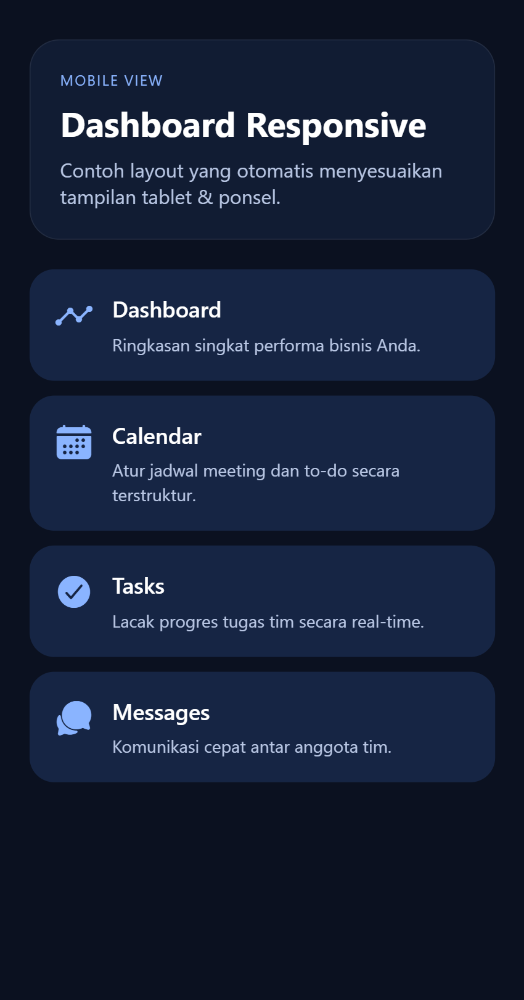
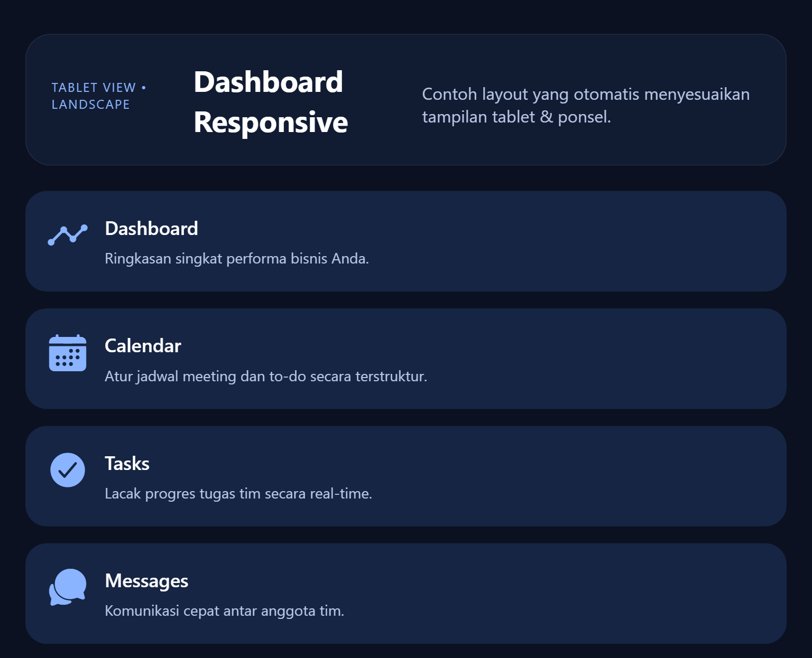

# Mobile Device Programming

This repository contains a collection of assignments from the **Mobile Device Programming** course. Each learning session has its own task folder that can be accessed through the application navigation

## 📚 Assignment List

### Session 10 Assignment

**Location**: [`app/task10/`](app/task10/)

-   Add a new breakpoint for large-tablet layout.

-   Add icons to each card and ensure responsive scaling.

-   Implement orientation-aware layout using width-height comparison.

Screenshots:

  
  
  

---

### Session 11 Assignment

**Location**: [`app/task11/`](app/task11/)

Adding new column (finished at) and filter by status (Done, Undone)

---

### Session 12 Assignment

**Location**: [`app/task12/`](app/task12/)

---
